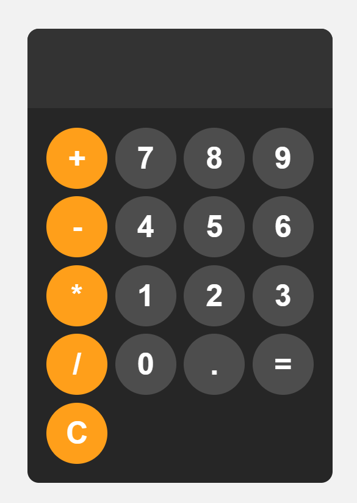

# Calculator Web 

A simple, responsive calculator built with HTML, CSS, and JavaScript. Features a clean, modern dark theme design with an intuitive user interface.

## Features

- ✨ Clean, modern dark theme design
- 🔢 Basic arithmetic operations (addition, subtraction, multiplication, division)
- 📱 Fully responsive design that works on all screen sizes
- ⚡ Real-time calculation display
- 🎯 Centered layout with optimal sizing
- 🎨 Smooth hover and active button effects
- 🟠 Color-coded operator buttons for better UX

## Demo

 

## Technologies Used

- **HTML5** - Structure and layout
- **CSS3** - Styling and responsive design
- **JavaScript** - Calculator functionality and logic

## File Structure

```
calculator/
├── index.html      # Main HTML file
├── styles.css      # CSS styling
├── index.js        # JavaScript functionality
└── README.md       # Project documentation
```


## How to Use

1. Click on number buttons (0-9) to input numbers
2. Click on operator buttons (+, -, *, /) to perform operations
3. Click the equals button (=) to calculate the result
4. Click the clear button (C) to reset the calculator
5. Use the decimal point (.) for floating-point numbers

## Design Features

### Color Scheme
- **Background**: Light gray (`hsl(0, 0%, 95%)`)
- **Calculator Body**: Dark gray (`hsl(0, 0%, 15%)`)
- **Display**: Darker gray (`hsl(0, 0%, 20%)`)
- **Number Buttons**: Medium gray (`hsl(0, 0%, 30%)`)
- **Operator Buttons**: Orange (`hsl(35, 100%, 55%)`)

### Responsive Design
- Fixed width of 400px for optimal viewing
- Maximum width of 90vw for smaller screens
- Centered layout using CSS Flexbox
- Touch-friendly button sizes (80px × 80px)

## Browser Compatibility

This calculator works on all modern browsers including:
- Chrome
- Firefox
- Safari
- Edge

## Contributing

1. Fork the repository
2. Create a feature branch (`git checkout -b feature/new-feature`)
3. Commit your changes (`git commit -am 'Add new feature'`)
4. Push to the branch (`git push origin feature/new-feature`)
5. Create a Pull Request

## Future Enhancements

- [ ] Add keyboard support
- [ ] Implement memory functions (M+, M-, MR, MC)
- [ ] Add scientific calculator mode
- [ ] Include calculation history
- [ ] Add light/dark theme toggle
- [ ] Implement advanced operations (square root, percentage, etc.)

## License

This project is open source and available under the [MIT License](LICENSE).

## Author

P.SaiManikantaVarma
https://github.com/manikantavarma2889

---

⭐ If you found this project helpful, please give it a star on GitHub!
